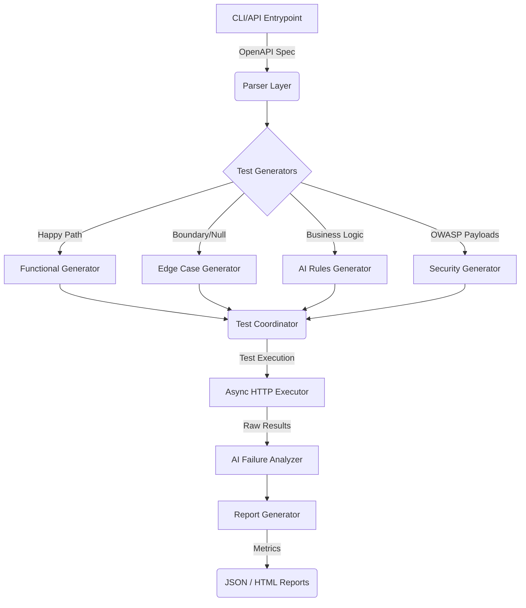

# AITester Architecture

## Overview

AITester is built as a robust, monolithic FastAPI application designed to intelligently parse OpenAPI specifications, generate diverse test scenarios, execute them concurrently, and leverage Google Gemini for root-cause failure analysis. It aims to provide seamless end-to-end API testing.

## System Components

## Core Modules

### 1. Parser (`aitester/parser`)
Validates and parses incoming OpenAPI 3.x specifications (via URL or local file). Resolves `$ref` schemas to create flattened objects for downstream generation.

### 2. Generators (`aitester/generators`)
- **Functional**: Extracts `required` fields and generates standard positive test cases using `Faker`.
- **Edge Case**: Specifically generates boundary errors, null inputs, and malformed types.
- **Security**: Injects standard OWASP payloads into path, query, and body parameters.
- **AI/Business Logic**: Delegates contextual inference to Gemini, mapping complex domain rules to test scenarios.

### 3. Async Executor (`aitester/executor`)
High-performance execution engine utilizing `httpx` and `asyncio.gather`. It throttles concurrent executions via semaphores (default 50) and collects deep timing/telemetry data per request.

### 4. AI Engine (`aitester/ai`)
Handles seamless communication with Google's Gemini models using the modern `google-generativeai` SDK. Features graceful degradation if API limits are hit, backing off and defaulting to heuristic rules.

### 5. Reporting (`aitester/reports`)
Takes the raw results, executes risk-scoring algorithms on the test failures, and uses `Jinja2` to render a human-readable HTML dashboard alongside a machine-readable JSON structure.

## Infrastructure

- **Web Framework:** FastAPI + Uvicorn
- **Database:** PostgreSQL (asyncpg) + SQLAlchemy ORM (for test runs & telemetry)
- **Cache / PubSub:** Redis (for async task coordination and caching spec validations)
- **Deployment:** Docker & docker-compose orchestrating the monolith alongside the database layers.
